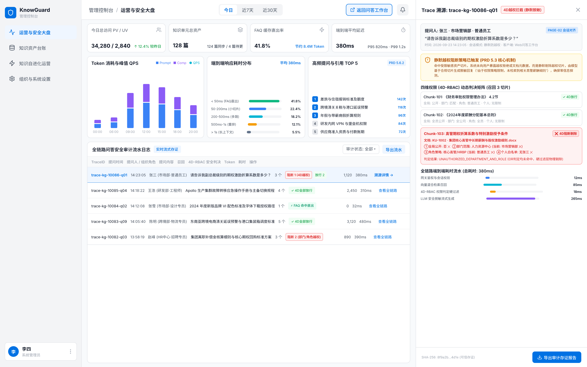
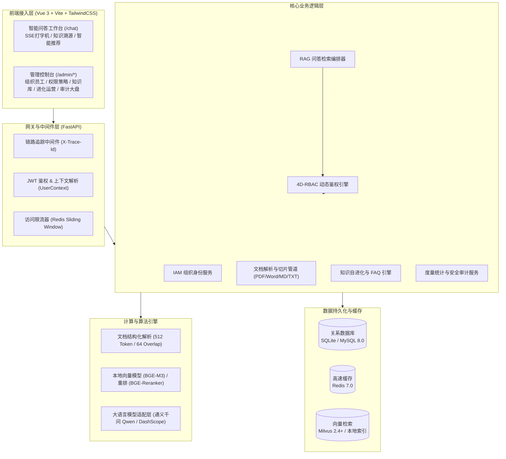

# KnowGuard 智能知识库管理平台

<p align="center">
  
</p>

<p align="center">
  <strong>专为企业级环境打造的安全可控、内容自进化的 RAG 智能知识库中枢</strong>
</p>

<p align="center">
  
  
  
  
  
  
  
</p>

---

## 📌 项目背景与解决的痛点

通用 RAG（检索增强生成）系统在直接应用到企业内部知识库时，普遍面临两大结构性痛点：

1. **越权泄密风险（Security Gap）**  
   通用检索器在向量初筛时缺乏切片级（Chunk-level）组织身份感知。高密级的薪酬福利、高管期权、财务预算等文档一旦入库，普通员工通过模糊提问或 Prompt 诱导即可轻易召回机密切片。若依赖模型弱提示词防御或抛出明显的 `403 Forbidden`，反而会让提问者感知到机密文档的存在。
2. **知识库上线即僵死（Evolution Gap）**  
   缺乏真实问答数据的运营反哺机制。高频通用问题反复调用大模型，造成响应延迟与 Token 算力浪费；同时员工未被解答的“知识盲区”散落在日志流水中，运营团队无法系统性排查与补齐。

**KnowGuard** 针对上述问题，提供了一套包含 **4D-RBAC 切片级鉴权引擎**、**Silent Fallback 静默脱敏回退**、**知识自进化飞轮（FAQ 缓存 + 盲区闭环）** 以及 **全链路安全存证** 的工程落地解决方案。

---

## 💡 核心特性

### 1. 4D-RBAC 四维切片级鉴权引擎
在向量召回后、Prompt 组装前执行物理隔离过滤，基于以下四维实体配置裁决规则：
* **全局维度**：全员公开文档（如通用制度）。
* **部门维度**：支持部门树层级继承与递归向下包含（如“研发中心”及下属子团队）。
* **角色维度**：基于岗位角色放行（如“财务审计员”、“知识管理员”）。
* **个人维度**：精确授权至具体员工工号。
* **充分条件裁决**：任意满足一维即合规放行；未授权切片在送入大模型前被**物理剔除**，彻底杜绝上下文越权注入。

### 2. Silent Fallback 静默脱敏回退
* 当员工提问命中自身无权访问的机密切片时，系统在后台对该切片实施硬隔离，前台输出自然礼貌的通用回复（如 *“根据现有权限范围，未检索到相关细则，请联系对应部门接口人”*）。
* **零信息探测**：不向前端暴露“无权查看此文档”等报错信息，防止攻击者通过爆破探测机密资产。

### 3. 知识自进化运营飞轮 (Evolution Flywheel)
* **知识盲区捕获（Knowledge Gaps）**：未命中知识库或置信度低于阈值的提问自动沉淀至待办池，记录命中频次，支持一键转建文档补全工单。
* **FAQ 候选挖掘与高速直出**：基于高频提问自动提炼官方标准问答对，发布后写入 Redis 高速缓存，匹配提问时实现 **<50ms 极速直出**，大幅降低 LLM 调用成本。

### 4. 沉浸式流式问答工作台
* **原生 SSE 打字机流式响应**：事件帧逐步输出回答内容。
* **精准知识溯源卡片**：展示回答引用的文档名称、切片定位与匹配置信度（置信度 >60% 且最多展示 4 条）。

### 5. 全链路安全审计与运营大盘
* **链路追踪注入**：全流程打标 `X-Trace-Id`，完整记录提问人、组织角色、初筛召回切片、4D 放行切片与拦截切片明细。
* **度量监控大盘**：实时呈现 PV/UV、Token 消耗双轴走势、峰值 QPS、5 级响应耗时分布图与高频提问 TOP 5 动态榜单。

---

## 🏛️ 系统总体架构



---

## 🛠️ 技术栈选型

| 分层领域 | 关键技术 | 选型说明 |
| :--- | :--- | :--- |
| **后端框架** | Python 3.12+, FastAPI, Pydantic V2 | 异步高并发处理、原生 SSE 流式支持与强类型校验 |
| **持久化与 ORM** | SQLAlchemy 2.0 (Async), SQLite / MySQL 8.0 | 支持生产级关系型存储与轻量化独立运行模式 |
| **缓存与限流** | Redis 7.0 | FAQ 极速缓存直出、高频问答去重与滑动窗口限流 |
| **向量与重排** | BAAI/bge-m3, BAAI/bge-reranker | 高精度多语言稠密/稀疏向量表征与语义重排序 |
| **LLM 接入层** | 通义千问 (Qwen-Plus / DashScope API) | 企业级大语言模型稳定推理支撑 |
| **前端架构** | Vue 3, Vite, TypeScript, Pinia, Vue Router | 现代化单页面应用与类型安全保证 |
| **UI 与可视化** | TailwindCSS, Lucide Vue Next, Apache ECharts | 响应式设计、企业级图标库与多维运营图表 |
| **工程管理** | UV (Python Package Manager), ESLint | 极速依赖锁定与现代化打包发布构建 |

---

## 🚀 快速启动指南

### 1. 环境准备
* **Python**：3.12 或更高版本（推荐安装 [`uv`](https://github.com/astral-sh/uv) 极速包管理器）
* **Node.js**：18.0 或更高版本（包含 `npm`）

### 2. 获取代码与环境变量配置
```bash
git clone https://github.com/your-username/knowguard.git
cd knowguard

# 配置后端环境变量
cp backend/.env.example backend/.env
```

> **提示**：若需要使用云端 LLM，请在 `backend/.env` 中配置 `DASHSCOPE_API_KEY=your_key`。本地测试环境默认已配置内置数据库与本地向量适配。

---

### 3. 后端服务启动

```bash
cd backend

# 安装依赖
uv sync
# 或使用标准 pip:
# python3 -m venv .venv && source .venv/bin/activate && pip install -r requirements.txt

# 初始化数据库结构与基础种子数据 (二选一):
# 方式 A (内置环境 / 极速开箱):
uv run python scripts/seed.py
# 方式 B (独立 MySQL 8.0+ 导入):
# mysql -u root -p < sql/init.sql

# 启动后端 API 服务 (端口: 8000)
uv run uvicorn main:app --host 0.0.0.0 --port 8000 --reload
```

* 后端服务接口文档：[http://localhost:8000/docs](http://localhost:8000/docs) (Swagger UI)

---

### 4. 前端服务启动

```bash
cd front

# 安装依赖
npm install

# 启动开发服务器 (端口: 5173)
npm run dev
```

* 前端交互界面访问：[http://localhost:5173](http://localhost:5173)

---

## 👥 预置测试账号矩阵

系统数据库播种脚本预置了覆盖不同业务部门与安全权限的典型账号，可用于全链路功能测试与权限隔离验证：

| 登录账号 | 员工工号 | 姓名 | 所属部门 | 业务角色 | 默认密码 | 预置权限与验证场景 |
| :--- | :--- | :--- | :--- | :--- | :--- | :--- |
| **`wangwu`** | `10088` | 王五 | 管理层 | 超级管理员 (`ROLE_SUPER_ADMIN`) | `123456` | 拥有全部前后台功能，可查看高管期权制度、全量审计大盘与系统配置 |
| **`lisi`** | `10087` | 李四 | 财务部 | 知识管理员 (`ROLE_KNOWLEDGE_ADMIN`) | `123456` | 负责知识库维护、文档切片解析监控、FAQ 审核发布与盲区工单流转 |
| **`zhangsan`** | `10086` | 张三 | 研发部 | 普通员工 (`ROLE_COMMON_USER`) | `123456` | 仅具备问答工作台权限，提问高管敏感制度时触发 **Silent Fallback** 阻断 |

---

## 📂 项目工程目录

```text
knowguard/
├── backend/                        # 后端核心工程 (FastAPI + Python 3.12)
│   ├── app/
│   │   ├── api/v1/                 # RESTful API 路由分发 (auth/chat/knowledge/system/...)
│   │   ├── core/                   # 核心配置、数据库连接池、JWT 安全与异常处理
│   │   ├── models/                 # SQLAlchemy 2.0 ORM 数据模型
│   │   ├── schemas/                # Pydantic V2 请求与响应契约 DTO
│   │   ├── services/               # 业务服务层 (IAM, Ingestion, RAG, 4D-Guard, Analytics)
│   │   └── providers/              # 外部大模型与向量服务驱动适配 (Qwen, BGE-M3)
│   ├── scripts/
│   │   └── seed.py                 # 数据库初始化与种子数据注入脚本
│   ├── tests/                      # 单元测试与端到端回归测试集
│   ├── pyproject.toml              # UV / Python 项目元数据与依赖定义
│   └── main.py                     # FastAPI 应用程序入口
│
├── front/                          # 前端工程 (Vue 3 + Vite + TypeScript)
│   ├── src/
│   │   ├── api/                    # Axios API 请求封装
│   │   ├── components/             # 业务组件 (问答工作台、ECharts图表、审计抽屉)
│   │   ├── stores/                 # Pinia 状态管理 (auth, chat, knowledge, analytics)
│   │   ├── views/                  # 视图页面 (Login, Chat, Knowledge, Admin)
│   │   ├── router/                 # Vue Router 路由守卫与动态权限菜单过滤
│   │   └── types/                  # 全局 TypeScript 契约定义
│   ├── package.json
│   └── vite.config.ts
│
├── sql/                            # 数据库建表与初始化 DDL / Seed 脚本
│   └── init.sql                    # 包含 14 张核心表结构与默认种子数据 (MySQL 8.0+)
│
├── docs/                           # 官方文档静态资源
│   └── images/                     # 架构图、封面图与原型展示图
│
├── 项目工程文件/                    # 产品设计资产与架构总纲
│   ├── KNOWGUARD_PRD.md            # 产品需求说明书 (PRD)
│   ├── KnowGuard智能知识库管理平台概要设计总纲.md
│   └── 原型图/                     # 原型设计规范与产物
└── README.md                       # 项目主文档
```

---

## 🔌 核心 API 概览

| 模块类别 | 接口路径 | 请求方式 | 功能描述 |
| :--- | :--- | :---: | :--- |
| **身份与认证** | `/api/v1/auth/login` | `POST` | 员工账号密码登录，颁发 Access & Refresh Token |
| | `/api/v1/auth/me` | `GET` | 获取当前登录用户的组织、角色与权限清单 |
| **智能问答** | `/api/v1/chat/completions` | `POST` | 核心 AI 鉴权问答（原生 `text/event-stream` SSE 流式返回） |
| | `/api/v1/chat/conversations` | `GET` | 分页获取当前用户的历史会话列表 |
| **知识库管理** | `/api/v1/knowledge/units/upload` | `POST` | 上传并启动文档解析与分块管道 (PDF/Word/MD/TXT) |
| | `/api/v1/knowledge/policies` | `POST` | 为知识单元配置/更新 4D-RBAC 权限策略 |
| **自进化运营** | `/api/v1/evolution/faqs` | `GET/POST` | 查询 FAQ 知识条目列表 / 新增发布标准 FAQ |
| | `/api/v1/evolution/gaps` | `GET` | 查询未闭环知识盲区待办池（按提问频次排序） |
| **监控与审计** | `/api/v1/analytics/summary` | `GET` | 获取运营大盘 5 大核心度量指标 (PV/UV/Token/FAQ直出率) |
| | `/api/v1/analytics/audit-logs` | `GET` | 分页检索全链路问答安全审计存证流水 |

---

## 🧪 自动化测试

项目内置完整的单元测试与链路回归用例：

```bash
# 执行后端核心模块自动化测试
cd backend
uv run pytest tests/test_m1_auth.py -v          # 身份认证与登录拦截
uv run pytest tests/test_m3_guard.py -v         # 4D-RBAC 权限裁决引擎
uv run pytest tests/test_m4_rag.py -v           # RAG 检索与 Silent Fallback
uv run pytest tests/test_p2_3_analytics.py -v   # 运营监控与审计聚合

# 前端代码类型检查与构建测试
cd front
npm run build
```

---

## 📄 开源许可证

本项目基于 [MIT License](LICENSE) 开源协议分发与使用。
